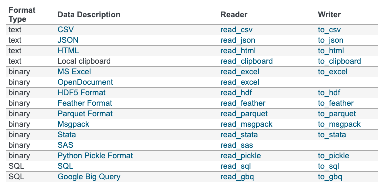

# Summary Data Visuvalization  

- Name - Sri Sai Srikar Bollapragada
- Date - 10/05/2022

## Data Analysis With Python
- What is Data Analysis ?
- Real world example of data analysis with python
- Usuage of Jupyter notebooks
- Introduction to numpy
- Introduction to pandas
- Data cleaning
- Reading data from different sources
- Overview of Python 

### What is data analysis
A process of inspecting, cleansing, transforming and modeling data with a goal of discovering useful information, informing conclusiom and supporting decision-making.

Programming languages are rather preferred than auto-managed closed tools main draw back is that we have to know the learn tha basics first and the learning process takes a lot of time by practising.

### Why python is preferred for data analysis?
1. Very simple an intutive to learn
2. Correct language
3. Powerful libraries
4. Free and open source.
5. Amazing community, docs and conferences

### Usage of R langugae
1. When r studio is needed
2. When dealing with advanced statistical methods
3. When extreme performance is needed

### The life cycle of a data analysis process
1. Data extraction - Extracting data from different sources
2. Data cleaning - cleaning the unwanted and null values from the data
3. Data wrangling - modifying the data according to the use cases
4. Analysis - finding patterns from data
5. Buildind models 

## Python Libraries
- Pandas: The cornerstone of our Data Analysis job with Python matplotlib: The foundational library for visualizations. Other libraries we’ll use will be built on top of matplotlib.

- Numpy: The numeric library that serves as the foundation of all calculations in Python.

- Seaborn: A statistical visualization tool built on top of matplotlib.

- Statsmodels: A library with many advanced statistical functions.

- Scipy: Advanced scientific computing, including functions for optimization, linear algebra, image processing and much more.

- Scikit-learn: The most popular machine learning library for Python

## Handy Jupyter Notebook Shortcut Commands
1. shift + enter - run cell, select below
2. ctrl + enter - run cell
3. option + enter - run cell, insert below
4. ctrl+A - insert cell above
5. ctrl+B - insert cell below
6. ctrl+C - copy cell
7. ctrl+V - paste cell
8. ctrl+D - D delete selected cell
9. ctrl+ shift + M - merge selected cells, or current cell with cell below if only one cell selected
10. ctrl+I - I interrupt kernel
11. ctrl+0 - 0 restart kernel (with dialog)
12. ctrl+ Y - change cell to code mode
13. ctrl+M - change cell to markdown mode (good for documentation)

## Numpy
Core package for numerical computation in python. Matplotlib, Pandas and other libraries rely on numpy.

- Using numpy we can create arrays and the array elements can be fetched using their indices.
- By using index of these arrays we can perform various operations.
- dtype() - this function return the datatype of the array.
- shape() - it gives the number of rows and columns present in a array of matrix.
- ndim() - gives number of dimensions.
- size() - gives the number of elements present.
- mean - returns the mean of the values.
- sum - returns the sum of the values
- std - returns the standard deviation.
- var - returns the variance.
- A.sum(axis = 0) - axis = 0 represents the column and the function return the sum of elements in the column.
- A.sum(axis = 1) - axis=1 represents the rows
- Arrays can be vectorized and can be able to perform varios mathematical operations.
- .dot - return the dot product.
- @ - return the cross product.
- T - Gives the trabspose of a matrix.
- reshape - changes the rows to columns and columns to rows.

## Pandas
It is the main library used for visuaization.

- dtype() - return the datatype of the dataframe.
- values - lists out the values in the data frame.
- iloc[0] - the value at the particular index will be displayed.
- index - makes a particular column the main index of the data frame.
- column - displays all the columns of the data frame.
- into - gives the info of the dataframe.
- describe - describes the entire data frame in the form of a table.
- loc - selects the matching row of the given index.
- iloc - works with numeric position of the index.
- rename - can be used to rename the name of the columns or the values.
- head() - gives the first five rows of data from the data frame.
- tail() - gives the last five rows of data from the data frame.
- sample() - gives the random rows of data from the data frame.

## Data Cleaning
It is the process of identifying the null values and filling up those null values as per the need.

- fillna - fills the null values with some arbitary values.
- ffill - forwardly fills the null values.
- bfill - backwardly fills the null values.
- Any and all methods check if there's any True value in a series or all the values are True.
- value_counts - gives how many times the value is repeated in the dataframe.

## Reading Data
Instead of creating dataframes and series with the pandas, we can read data from CSV files and other formats of data.

- with open('filename',r) - A file can be invoked by using open() and it is a single requried argument that has a single return, with statement automatically takes care of closing the file once it leaves the with block, even in cases of error.
- .to_csv('out.csv') - to save the data to csv file.
There are many other available reading functions as the following table shows:

### To read the data from relational databases
- !sqlalchemy - the module to be downloaded to read sql databases.
- sqlite3 - library to be downloaded to fetch sql data.
- conn = sqlite3.connect('123.db')
### To read the data from html
- lxml module to be installed
- read_html('URL') - to read the data from the html.
